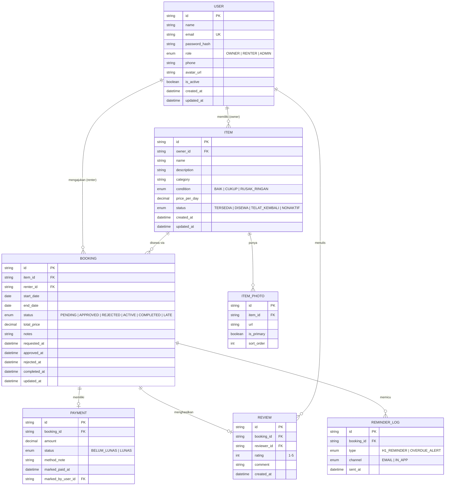

# Database Design — Rental Sewa Barang Tracker

Database: **PostgreSQL**, dikelola via **Prisma ORM** (migration & client generation).

## 1. ERD

## 2. Skema Tabel

### `users`
| Kolom | Tipe | Constraint |
|---|---|---|
| id | uuid | PK |
| name | varchar(120) | not null |
| email | varchar(160) | unique, not null |
| password_hash | varchar(255) | not null |
| role | enum(OWNER, RENTER, ADMIN) | not null |
| phone | varchar(30) | nullable |
| avatar_url | varchar(255) | nullable |
| is_active | boolean | default true |
| created_at | timestamptz | default now() |
| updated_at | timestamptz | auto-update |

### `items`
| Kolom | Tipe | Constraint |
|---|---|---|
| id | uuid | PK |
| owner_id | uuid | FK → users.id, not null, index |
| name | varchar(160) | not null |
| description | text | nullable |
| category | varchar(80) | not null, index |
| condition | enum(BAIK, CUKUP, RUSAK_RINGAN) | not null |
| price_per_day | numeric(12,2) | not null |
| status | enum(TERSEDIA, DISEWA, TELAT_KEMBALI, NONAKTIF) | not null, default TERSEDIA, index |
| created_at / updated_at | timestamptz | — |

### `item_photos`
| Kolom | Tipe | Constraint |
|---|---|---|
| id | uuid | PK |
| item_id | uuid | FK → items.id, not null, index, on delete cascade |
| url | varchar(255) | not null |
| is_primary | boolean | default false |
| sort_order | int | default 0 |

### `bookings`
| Kolom | Tipe | Constraint |
|---|---|---|
| id | uuid | PK |
| item_id | uuid | FK → items.id, not null, index |
| renter_id | uuid | FK → users.id, not null, index |
| start_date | date | not null |
| end_date | date | not null, check(end_date >= start_date) |
| status | enum(PENDING, APPROVED, REJECTED, ACTIVE, COMPLETED, LATE) | not null, default PENDING, index |
| total_price | numeric(12,2) | not null |
| notes | text | nullable |
| requested_at | timestamptz | default now() |
| approved_at / rejected_at / completed_at | timestamptz | nullable |
| updated_at | timestamptz | auto-update |

Index komposit: `(item_id, status)` — dipakai untuk cek cepat apakah ada booking `PENDING`/`APPROVED`/`ACTIVE` lain saat validasi BR1.

### `payments`
| Kolom | Tipe | Constraint |
|---|---|---|
| id | uuid | PK |
| booking_id | uuid | FK → bookings.id, unique (1:1), not null |
| amount | numeric(12,2) | not null |
| status | enum(BELUM_LUNAS, LUNAS) | not null, default BELUM_LUNAS |
| method_note | varchar(255) | nullable (misal "transfer BCA") |
| marked_paid_at | timestamptz | nullable |
| marked_by_user_id | uuid | FK → users.id, not null |

### `reviews`
| Kolom | Tipe | Constraint |
|---|---|---|
| id | uuid | PK |
| booking_id | uuid | FK → bookings.id, unique (1:1), not null |
| reviewer_id | uuid | FK → users.id, not null |
| rating | smallint | not null, check(rating between 1 and 5) |
| comment | text | nullable |
| created_at | timestamptz | default now() |

### `reminder_logs`
| Kolom | Tipe | Constraint |
|---|---|---|
| id | uuid | PK |
| booking_id | uuid | FK → bookings.id, not null, index |
| type | enum(H1_REMINDER, OVERDUE_ALERT) | not null |
| channel | enum(EMAIL, IN_APP) | not null |
| sent_at | timestamptz | default now() |

Unique constraint: `(booking_id, type)` — menegakkan BR5 (idempoten, satu jenis reminder sekali per booking).

## 3. Relasi & Alasan

- **User 1—N Item (owner):** satu Owner bisa punya banyak barang; `items.owner_id` wajib merujuk user dengan role `OWNER` (divalidasi di application layer, bukan constraint DB, karena Postgres enum tidak mudah cross-check role di FK).
- **User 1—N Booking (renter):** satu Renter bisa mengajukan banyak booking, historis maupun aktif.
- **Item 1—N Booking:** satu barang punya banyak booking sepanjang waktu, tapi hanya boleh ada satu booking berstatus `APPROVED`/`ACTIVE` dalam satu waktu (BR1, ditegakkan di application layer + index komposit di atas).
- **Booking 1—1 Payment:** setiap booking yang disetujui punya tepat satu record payment untuk dilacak status lunasnya.
- **Booking 1—1 Review:** review dibatasi satu per booking (BR4), dan hanya bisa dibuat kalau `bookings.status = COMPLETED`.
- **Booking 1—N ReminderLog:** satu booking bisa punya beberapa entri log (H-1 dan overdue berbeda type), tapi tidak boleh duplikat per type (BR5).

## 4. Strategi Indexing

- `items(status)` dan `items(category)` — dipakai berat oleh halaman Browse & Discovery (filter kategori, hanya tampilkan `TERSEDIA`).
- `bookings(item_id, status)` — dipakai untuk cek ketersediaan sebelum approve (BR1) dan menampilkan riwayat per barang.
- `bookings(renter_id)` — dipakai untuk halaman "booking saya" milik Renter.
- `users(email)` — unique index, dipakai oleh NextAuth credentials lookup saat login.

## 5. Strategi Migrasi & Seed Data

- Migration dikelola lewat `prisma migrate dev` (lokal) dan `prisma migrate deploy` (staging/production) — dijalankan sebagai step terpisah di CI/CD, bukan otomatis saat app start.
- Seed data (`prisma/seed.ts`) menyediakan: 1 user Admin, 2 user Owner, 2 user Renter, masing-masing Owner punya 2–3 Item dengan kondisi/kategori berbeda, dan beberapa Booking contoh mencakup status `PENDING`, `APPROVED`, `COMPLETED` (dengan Review) — struktur contoh, bukan data produksi asli.
- Setiap perubahan skema **wajib** memperbarui dokumen ini di commit yang sama (lihat `.claude/rules/decision-logging.md`), dan idealnya dijalankan lewat skill `/db-migration`.

## 6. Soft-Delete / Audit Trail / Retensi Data

- **Item & User:** menggunakan flag `is_active` / status `NONAKTIF` (soft-disable), bukan hard delete — supaya riwayat booking lama tetap merujuk data yang valid secara referensial.
- **Booking, Payment, Review, ReminderLog:** tidak pernah dihapus (append-only secara praktik) — ini *adalah* audit trail transaksi, dipertahankan permanen selama akun terkait aktif.
- Retensi data penuh (arsip/purge setelah N tahun) belum diperlukan di Phase 1 — dicatat sebagai kandidat kebijakan Phase 2 kalau ada kebutuhan compliance spesifik.
