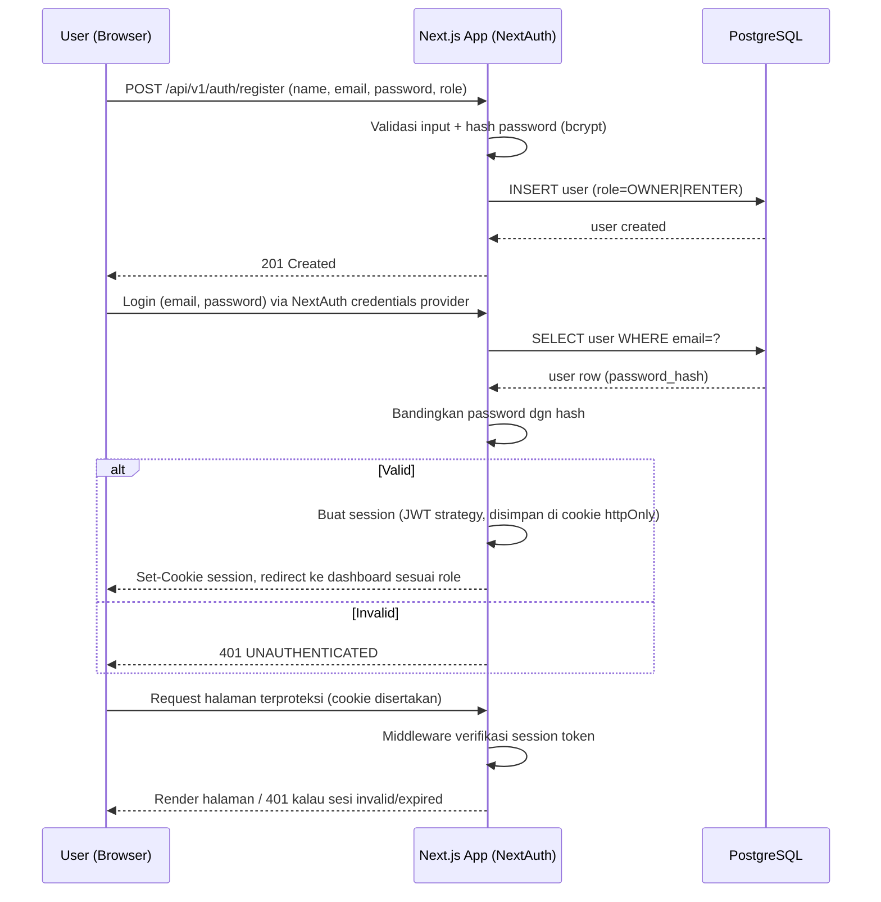
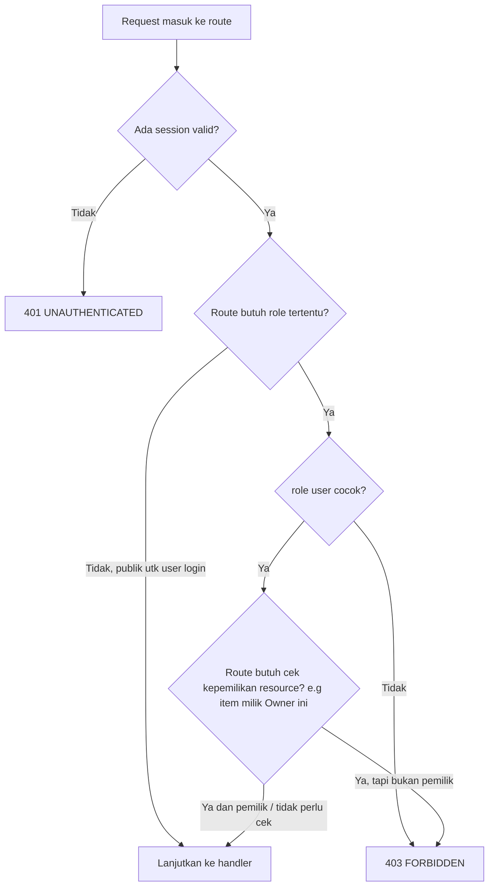

# Auth & Permission Flow — Rental Sewa Barang Tracker

## 1. Flow Autentikasi

- **Strategi sesi:** JWT strategy NextAuth (session token di cookie httpOnly, tidak butuh lookup DB tiap request) dengan `role` disertakan di JWT payload agar middleware bisa memeriksa tanpa query tambahan.
- **Refresh:** NextAuth JWT diperpanjang otomatis selama masih dalam rolling session window (default 30 hari, dikonfigurasi di `technical-spec.md`); tidak ada refresh token terpisah karena memakai session strategy, bukan pure API token.

## 2. Flow Otorisasi (Role Guard)

- **Middleware layer (`middleware.ts`):** mengecek keberadaan & validitas session sebelum request mencapai route group `(dashboard)` — menolak dengan redirect ke `/login` untuk halaman, atau `401` untuk API.
- **Role guard per route group:** route dikelompokkan per role di App Router (`app/(owner)/**`, `app/(renter)/**`, `app/(admin)/**`), masing-masing punya layout yang memeriksa `session.user.role` sesuai permission matrix di `docs/prd.md`.
- **Ownership check:** untuk aksi seperti update barang atau approve booking, handler API tetap wajib memverifikasi `resource.owner_id === session.user.id` di level service/query — role guard saja tidak cukup karena satu role (Owner) bisa punya banyak user berbeda.
- Detail konvensi implementasi (nama helper, lokasi kode) ada di `docs/technical-spec.md` dan `.claude/rules/api-design.md`.
