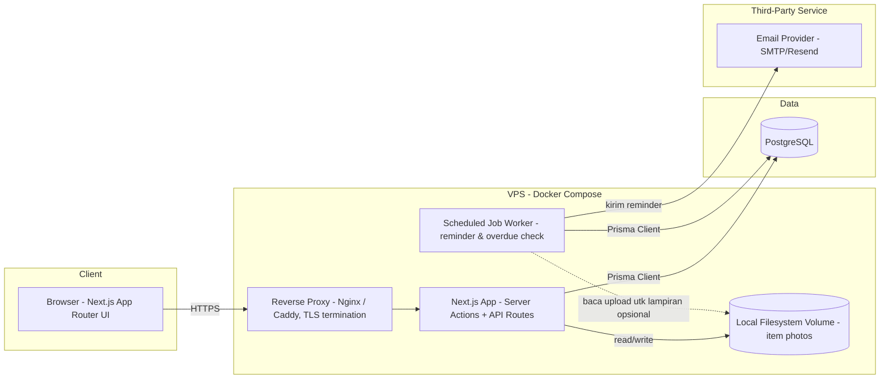

# System Architecture — Rental Sewa Barang Tracker

## 1. Diagram Arsitektur

## 2. Komponen

- **Next.js App (App Router):** merangkap frontend (React Server/Client Components) dan backend (Route Handlers `app/api/v1/**`, Server Actions untuk mutasi form). Modular monolith — satu deployable unit, dipisah per domain secara folder (lihat `technical-spec.md`).
- **Scheduled Job Worker:** proses terpisah (long-running Node script atau cron container) yang menjalankan pengecekan reminder H-1 dan overdue setiap interval tertentu (misal tiap 15 menit), lalu memanggil layanan yang sama dengan `POST /api/v1/internal/reminders/run` (atau memanggil fungsi service langsung tanpa HTTP jika dalam satu codebase — keputusan detail di `technical-spec.md`).
- **PostgreSQL:** satu instance database untuk seluruh data transaksional.
- **Local Filesystem Volume:** direktori terpisah (mis. `/data/uploads`) yang di-mount sebagai Docker volume persisten, menyimpan foto barang. **Implikasi:** deployment tidak bisa ke platform serverless (Vercel) karena filesystem-nya ephemeral — lihat ADR di `docs/decision-log.md`.
- **Email Provider:** SMTP pihak ketiga (atau Resend) dipakai worker untuk mengirim reminder — bukan dipanggil langsung dari request HTTP pengguna, supaya kegagalan kirim email tidak memblokir aksi user.

## 3. Topologi Deployment

- Reverse proxy (Nginx/Caddy) menangani TLS termination dan diteruskan ke container Next.js.
- Tidak ada load balancer/multi-instance di Phase 1 (single VPS instance) — dicatat di NFR sebagai target uptime 99%, bukan high-availability penuh.
- Struktur container (Docker Compose): `app` (Next.js), `worker` (scheduled job), `db` (Postgres, atau managed Postgres eksternal), dengan volume terpisah untuk `uploads` dan `postgres data`.
- Environment terpisah: `local` (docker-compose dev + `.env.local`), `staging`, `production` — detail di `technical-spec.md` bagian strategi environment.
