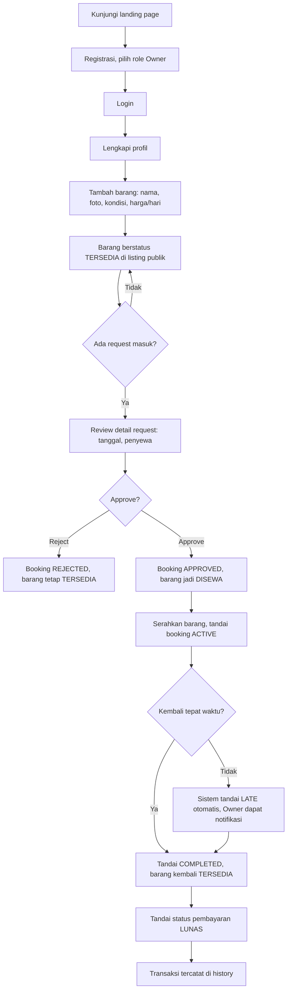
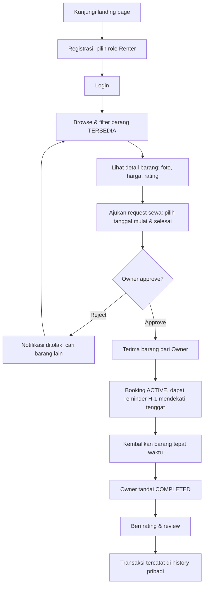

# User Flow — Rental Sewa Barang Tracker

## 1. Journey Owner: dari registrasi sampai barang disewa

## 2. Journey Renter: dari cari barang sampai review

## 3. Ringkasan Titik Keputusan Penting

- **Approval barang (Owner):** satu-satunya titik yang mengunci ketersediaan barang (BR1 di `prd.md`) — request lain otomatis ditolak begitu satu disetujui.
- **Reminder H-1 & overdue:** dikirim otomatis oleh job terjadwal, tidak butuh aksi user, tapi memengaruhi urutan aksi Renter (dorongan untuk mengembalikan tepat waktu).
- **Review:** hanya muncul sebagai opsi setelah booking berstatus `COMPLETED`, mencegah review prematur.
