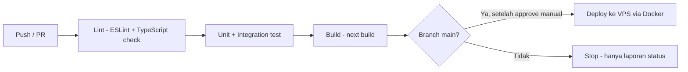

# Technical Specification — Rental Sewa Barang Tracker

## 1. Keputusan Arsitektur

**Modular monolith** (bukan microservices, bukan monolith tanpa struktur). Satu aplikasi Next.js yang menangani frontend & backend, tapi kode dipisah per domain (`items`, `bookings`, `payments`, `reviews`, `reminders`, `auth`) dengan boundary yang jelas antar modul (masing-masing punya service layer sendiri, tidak saling query database lintas modul secara langsung tanpa lewat service).

**Alasan:** skala awal (target 50 barang, 20 transaksi/3 bulan — lihat `prd.md`) tidak butuh kompleksitas microservices (deployment terpisah, network overhead, distributed transaction). Modular monolith tetap memberi jalur migrasi ke service terpisah nanti jika salah satu modul (misal reminder job) perlu di-scale independen — tanpa membayar biaya operasional microservices sejak awal.

**Ditolak:** microservices penuh sejak awal — over-engineering untuk skala saat ini dan menambah beban DevOps yang tidak sepadan dengan tim kecil.

## 2. Struktur Folder

```
src/
├── app/                          # App Router
│   ├── (public)/                 # landing, browse, detail barang
│   ├── (owner)/                  # dashboard Owner: CRUD barang, approve booking
│   ├── (renter)/                 # dashboard Renter: browse, booking saya, review
│   ├── (admin)/                  # panel Admin
│   └── api/v1/                   # Route Handlers per modul (items, bookings, payments, reviews, admin)
├── modules/
│   ├── auth/                     # NextAuth config, session helper, role guard
│   ├── items/                    # service, validasi, tipe domain Item
│   ├── bookings/                 # service, status machine booking
│   ├── payments/
│   ├── reviews/
│   └── reminders/                # logic pengecekan H-1 & overdue
├── lib/                          # prisma client, email client, upload helper
├── components/                   # UI components shared (lihat design-system.md)
└── middleware.ts                 # role guard di level route

prisma/
├── schema.prisma
└── seed.ts

worker/
└── reminder-job.ts               # entrypoint scheduled job (dijalankan container terpisah)
```

## 3. Autentikasi

- **NextAuth.js (Auth.js) credentials provider**, strategi sesi **JWT** (bukan database session) — cocok untuk modular monolith tanpa perlu query sesi tiap request.
- Password di-hash dengan **bcrypt** (cost factor 12).
- `role` disematkan di JWT payload via callback `jwt()`/`session()` NextAuth, dibaca `middleware.ts` untuk role guard tanpa query DB tambahan.
- Rolling session 30 hari; tidak ada refresh token terpisah (bawaan strategi JWT NextAuth yang re-issue token saat masih valid).

## 4. Strategi Caching

- **Phase 1:** caching minimal — mengandalkan Next.js data cache bawaan (`fetch` cache / `revalidate`) untuk halaman Browse & Discovery yang tidak butuh data real-time ketat (revalidate tiap 60 detik cukup untuk listing barang).
- Tidak ada Redis di Phase 1 (skala belum membutuhkan) — dicatat sebagai kandidat penambahan kalau traffic browse meningkat signifikan (lihat catatan skalabilitas).

## 5. Strategi Background Job / Queue

- **Reminder & overdue check** berjalan sebagai proses Node terpisah (`worker/reminder-job.ts`) di dalam container Docker sendiri, dipicu scheduler OS-level (cron) setiap 15 menit — bukan dalam siklus request Next.js, supaya kegagalan kirim email tidak memengaruhi latensi user.
- Job membaca `bookings` berstatus `ACTIVE` dengan `end_date = besok` (kirim `H1_REMINDER`) atau `end_date < hari ini` (kirim `OVERDUE_ALERT` + ubah status booking/item ke `LATE`/`TELAT_KEMBALI`), lalu menulis `ReminderLog` dengan constraint unique `(booking_id, type)` untuk mencegah kirim ganda (BR5).
- Tidak ada message queue (Redis/RabbitMQ) di Phase 1 — volume job rendah, cron + query terjadwal sudah cukup. Kandidat ditambahkan kalau volume booking bertumbuh signifikan.

## 6. Rate Limiting & Throttling

- Endpoint `auth/login` dan `auth/register` dibatasi (misal 5 percobaan/menit per IP) menggunakan middleware in-memory/Redis-less limiter (mis. `lru-cache` berbasis token bucket) — cukup untuk single-instance deployment Phase 1.
- Endpoint mutasi lain (create booking, review) dibatasi lebih longgar untuk mencegah spam, angka pasti ditentukan saat implementasi modul terkait.

## 7. Logging & Monitoring

- **Structured logging** (JSON) untuk semua request API dan job worker — level `info` untuk aksi bisnis penting (booking dibuat, disetujui, reminder terkirim), `error` untuk exception.
- Error tracking pihak ketiga (misal Sentry) direkomendasikan tapi opsional di Phase 1 — minimal wajib: log error tertangkap tersimpan ke stdout container agar bisa diinspeksi via `docker logs`.

## 8. Strategi Testing

- **Unit test:** service layer per modul (business rules seperti BR1–BR5), pakai Vitest/Jest.
- **Integration test:** API route handler + Prisma terhadap test database terpisah (bukan mock DB — memastikan constraint & transaction benar-benar teruji).
- **E2E test:** journey utama (registrasi → login → CRUD barang → booking flow lengkap) dengan Playwright.
- Target coverage: **≥70%** untuk `modules/` (business logic), E2E mencakup seluruh happy path di `docs/flows/user-flow.md`.
- Detail konvensi penulisan test ada di `.claude/rules/testing.md`.

## 9. CI/CD Pipeline



- Deploy ke production **tidak otomatis** setelah CI hijau — butuh trigger manual/approval, konsisten dengan aturan "jangan push/deploy tanpa konfirmasi" di `.claude/rules/git-workflow.md`.

## 10. Strategi Environment

- **local:** `.env.local`, Postgres via Docker Compose lokal, upload disimpan di folder lokal `./uploads` (gitignored).
- **staging:** environment terpisah dengan data dummy, dipakai untuk QA sebelum ke production.
- **production:** VPS + Docker Compose, volume persisten untuk `uploads` dan Postgres data, environment variable dikelola lewat file `.env` di server (tidak pernah dikomit — lihat `.env.example`).

## 11. Deployment

- Docker Compose dengan service: `app` (Next.js, `next start`), `worker` (reminder job), `db` (Postgres, atau boleh managed Postgres eksternal untuk mengurangi beban ops), `reverse-proxy` (Nginx/Caddy dengan TLS).
- **Constraint penting:** karena foto barang disimpan di filesystem lokal (ADR di `docs/decision-log.md`), volume `uploads` harus persisten antar deploy — deployment ke platform serverless (Vercel/Netlify) **tidak kompatibel** dengan desain ini.

## 12. Security Checklist

- Validasi input di setiap route handler (gunakan Zod atau setara) sebelum menyentuh Prisma.
- Proteksi CSRF pada form mutasi (bawaan Next.js Server Actions sudah menangani sebagian; untuk API route manual, pastikan `SameSite` cookie dan origin check).
- Secrets (DB URL, NextAuth secret, SMTP credential) hanya lewat environment variable, tidak pernah di-hardcode atau dikomit — lihat `.env.example`.
- Dependency scanning (misal `npm audit` atau Dependabot) dijalankan berkala di CI.
- Upload foto: validasi tipe file (whitelist ekstensi gambar) dan ukuran maksimum sebelum ditulis ke filesystem, untuk mencegah path traversal & file berbahaya.

## 13. Catatan Skalabilitas

- Horizontal scaling belum diperlukan Phase 1 (single instance) — arsitektur modular monolith memudahkan migrasi ke multi-instance di belakang load balancer nanti, asalkan session tetap stateless (JWT, bukan in-memory session — sudah dipenuhi).
- Kalau traffic Browse & Discovery meningkat signifikan: tambahkan Redis untuk cache listing barang sebelum mempertimbangkan read replica Postgres.
- CDN untuk asset statis (JS/CSS bundle) bisa ditambahkan di depan reverse proxy tanpa mengubah arsitektur inti; foto barang tetap disajikan dari VPS selama masih pakai filesystem lokal.

## 14. Integrasi Pihak Ketiga

- **Email (reminder):** SMTP provider atau Resend — dipanggil hanya dari `worker/reminder-job.ts`, kredensial di environment variable (lihat `.env.example`).
- Tidak ada integrasi payment gateway di Phase 1 (payment tracking manual — lihat `docs/prd.md` & ADR di `decision-log.md`).

## 15. Referensi

Untuk detail endpoint API (method, path, role, request/response), lihat `docs/api-spec.md` — tidak diduplikasi di sini.
